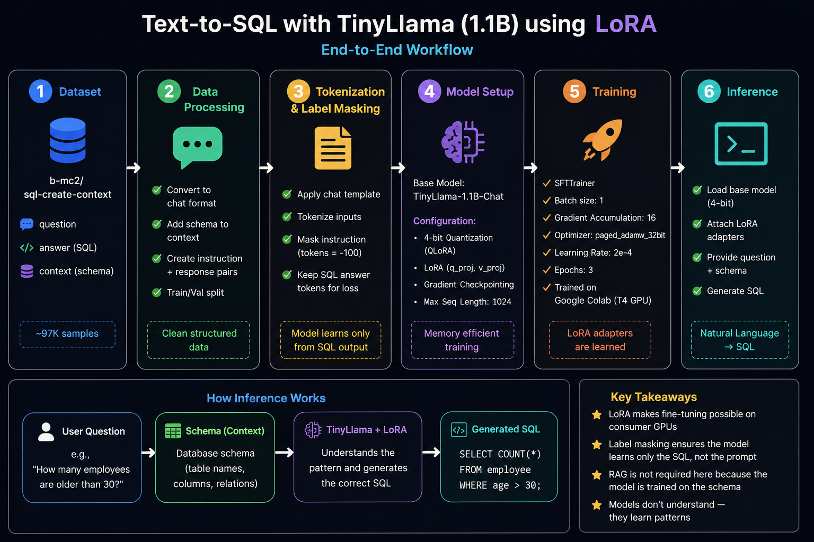
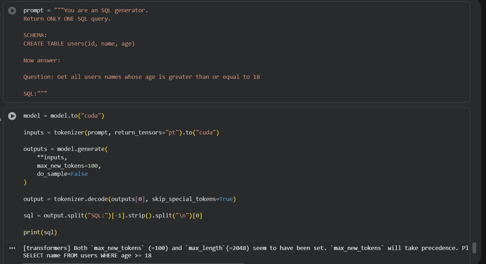

# 🚀 TinyLlama SQL Generator (LoRA Fine-Tuning)

This project demonstrates how to fine-tune a **TinyLlama (1.1B Chat)** model to generate **SQL queries from natural language** using **LoRA (Low-Rank Adaptation)**.

---

## 📌 Overview

* Convert natural language → SQL queries
* Use lightweight fine-tuning with LoRA
* Train on limited GPU (Google Colab T4)
* Focus on learning workflow, not large-scale training

---

## 🧠 Model & Dataset

### 🔹 Model Used

* [TinyLlama-1.1B-Chat-v1.0](https://huggingface.co/TinyLlama/TinyLlama-1.1B-Chat-v1.0)

### 🔹 Dataset Used

* [b-mc2/sql-create-context](https://huggingface.co/datasets/b-mc2/sql-create-context)

Dataset contains:

* `question` → natural language
* `answer` → SQL query
* `context` → database schema

---

## ⚙️ Workflow



---

## 🧪 Example Output



---

## ⚠️ Important Notes

* Not trained on full dataset
* Not trained on large models like Mistral
* Used small subset for faster experimentation
* Goal: understand fine-tuning pipeline

---

## 🛠️ How to Use

### 1️⃣ Load Base Model

```python
from peft import PeftModel
from transformers import AutoModelForCausalLM

base_model = AutoModelForCausalLM.from_pretrained(
    "TinyLlama/TinyLlama-1.1B-Chat-v1.0"
)
```

---

### 2️⃣ Load LoRA Weights

Download the trained LoRA adapter (`tinyllama-sql-lora`) and load:

```python
model = PeftModel.from_pretrained(
    base_model,
    "tinyllama-sql-lora"
)
```

---

### 3️⃣ Run Inference

```python
model = model.to("cuda")

inputs = tokenizer(prompt, return_tensors="pt").to("cuda")

outputs = model.generate(
    **inputs,
    max_new_tokens=100,
    do_sample=False
)

output = tokenizer.decode(outputs[0], skip_special_tokens=True)

sql = output.split("SQL:")[-1].strip().split("\n")[0]

print(sql)
```

---

## 💡 Key Learnings

* LLMs learn patterns, not meaning
* Fine-tuning helps control structured output
* LoRA enables training on limited hardware

---

## 📂 Project Files

* `tinyllama-sft-lora.ipynb` → training notebook
* `tinyllama-sft-lora-enhanced.ipynb` → improved version
* `workflow.png` → project pipeline
* `test.png` → inference example

---

## 🚀 Future Improvements

* Train on full dataset
* Use larger models (e.g., Mistral)
* Improve dataset diversity
* Better evaluation

---

## 📬 Connect

Feel free to reach out for feedback or collaboration 🚀
